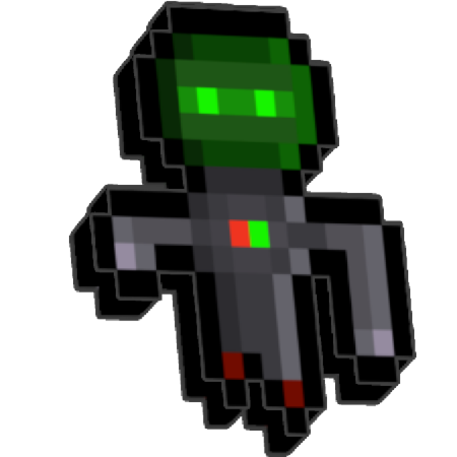

<h1 align="center">

Robot
</h1>

This Mod adds the Robot Tower into the game. The Robot Tower have 15 unique Upgrades + 1 Paragon Upgrade. I personally recommend playing this mod on the Steam version. If using the Epic Games version, it should be played without any other mods except for the Mod Helper Mods.

